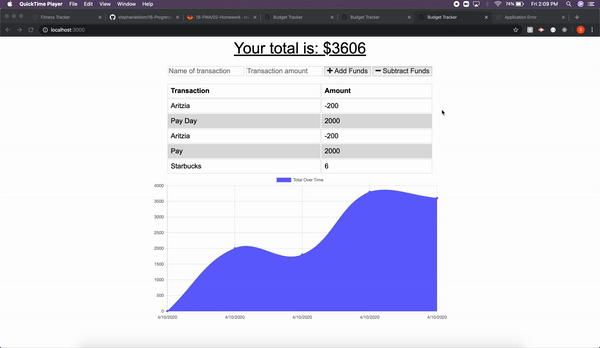

# 18-Progressive-Budget

# Description 

This app is a **P**rogressive **W**eb **A**plication for tracking a users personal budget. Users are able to input their income and spending to track their budget. Users can make changes offline which will be saved into the db once they return online. 

```
AS AN avid traveller
I WANT to be able to track my withdrawals and deposits with or without a data/internet connection
SO THAT my account balance is accurate when I am traveling
```

# DEMO 


## Installation

* Ensure that Node and npm are installed on your computer to run this application. 

* Use the [mongoose](https://www.npmjs.com/package/mongoose) NPM package to connect to your mongo database and perform queries.

* Use [express](https://www.npmjs.com/package/express) NPM for handling routes .

## Functionality 

* Users can input money coming into their account along with money leaving their account
* After each transaction a graph is updated displaying their budget
